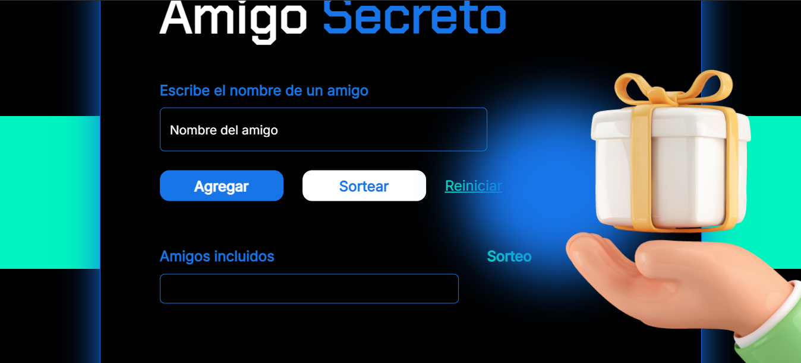

# 🎁 Amigo Secreto 🎉

---

## 📝 Descripción del Proyecto

**Amigo Secreto** es una aplicación web interactiva y fácil de usar, diseñada para organizar sorteos de amigo secreto de forma sencilla. Desarrollada con **HTML, CSS y JavaScript**, esta herramienta ofrece una interfaz intuitiva que facilita la gestión de participantes y la realización del sorteo.

---

## 🚀 Funcionalidades Principales

* **Añadir Participantes:** Permite agregar nombres a la lista de sorteo, con validación integrada para evitar duplicados, números o caracteres especiales, asegurando entradas limpias.
* **Eliminar Participantes:** Facilita la remoción de cualquier participante con un simple clic en su nombre, acompañada de un mensaje de confirmación amigable.
* **Realizar Sorteo:** Ejecuta el sorteo automáticamente una vez que se han registrado al menos 4 participantes, asignando un amigo secreto a cada uno y mostrando los resultados en un formato claro ("A → B").
* **Reiniciar Aplicación:** Borra todos los participantes y resultados del sorteo, permitiendo comenzar un nuevo juego al instante.

---

## 🛠️ Tecnologías Utilizadas

* **HTML5**: Para la estructura fundamental de la aplicación, incluyendo formularios y botones interactivos.
* **CSS3**: Para un diseño moderno y una experiencia visual atractiva y fácil de usar.
* **JavaScript**: Para la lógica central de la aplicación, manejando las validaciones, eventos de usuario y el algoritmo de sorteo.

---

## 📦 Cómo Usarlo

1.  **Clona el repositorio** en tu máquina local:
    ```bash
    git clone https://github.com/josecervera20/amigo-secreto.git
    ```
2.  **Navega al directorio del proyecto**:
    ```bash
    cd amigo-secreto
    ```
3.  **Abre el archivo `index.html`** en tu navegador web preferido.
4.  **Agregar participantes:** Escribe el nombre de un amigo en el campo de texto y haz clic en "Agregar".
    * **Importante:** Los nombres solo deben contener letras y espacios.
5.  **Eliminar participantes:** Simplemente haz clic en el nombre de cualquier participante en la lista para eliminarlo.
6.  **Realizar sorteo:** Cuando tengas al menos 4 participantes, haz clic en el botón "Sortear". Los resultados se mostrarán indicando quién le regala a quién.
7.  **Reiniciar la aplicación:** Haz clic en "Reiniciar" para borrar la lista y los resultados del sorteo, y empezar de nuevo.

---

## 🎨 Captura de Pantalla



---

## 🤝 Contribuciones

¡Las contribuciones son siempre bienvenidas! Si tienes ideas para mejorar este proyecto o encuentras algún problema, no dudes en:

1.  Hacer un `fork` del repositorio.
2.  Crear una nueva rama (`git checkout -b feature/nueva-funcionalidad`).
3.  Enviar un `pull request` con una descripción detallada de tus cambios.

---

## 📄 Licencia

Este proyecto es de código abierto y se publica bajo la [Licencia MIT](https://github.com/josecervera20/amigo-secreto.git/blob/main/LICENSE). Siéntete libre de usar, modificar y distribuir este código para tus propios proyectos.
